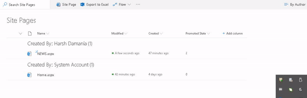

## unpromote-news

Prerequisites :
1. The PromotedState Column should not be readonly.To do so run the following powershell cmds.
```powershell
Get-PnPField -List "Site Pages" -Identity "PromotedState" 
```
2. Copy the ID and paste it below in Identity
```powershell
$columnID=Get-PnPField -Identity f5ad16a2-85be-46b2-b5f0-2bb8b4a5074a
$columnID.ReadOnlyField = $false
$columnID.UpdateAndPushChanges($true)
$c.Context.ExecuteQuery();
```


Extension(List View Command Set) for unpromotting a news (or unplublish a news)


What happens if the news is already unpromoted.


### Building the code

```bash
git clone the repo
npm i
npm i -g gulp
gulp
```

This package produces the following:

* lib/* - intermediate-stage commonjs build artifacts
* dist/* - the bundled script, along with other resources
* deploy/* - all resources which should be uploaded to a CDN.

### Build options

gulp clean - TODO
gulp test - TODO
gulp serve - TODO
gulp bundle - TODO
gulp package-solution - TODO
